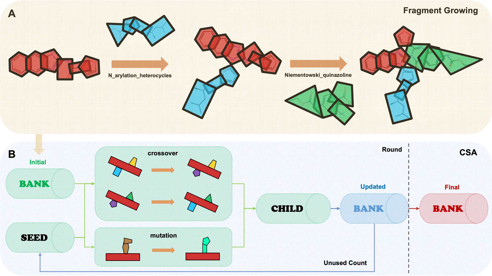

# MOZAIC 🧩

MOZAIC is a molecule optimization algorithm that combines SMARTS-based reaction-driven fragment growing with the Conformational Space Annealing (CSA) algorithm.

Starting from an initial molecule, MOZAIC performs fragment growing to build an initial bank of candidate molecules. It then applies crossover and mutation operators to increase structural diversity, and updates the bank using the Dcut criterion in CSA. As a result, MOZAIC outputs the globally optimized final bank and corresponding protein–ligand complex PDB structures.



---

## 🛠️ Installation & Environment

Clone the repository and create the conda environment:

```bash
git clone https://github.com/kucm-lsbi/MOZAIC.git
cd MOZAIC
```
```bash
conda env create -f environment.yaml
conda activate MOZAIC
```

## 🚀 Usage

### Arguments

| Argument | Status | Description |
|---|---|---|
| `-s` | Required | Path to the initial molecule SMILES file (`.smi`). |
| `-r` | Required | Path to the receptor file (`.pdb` or `.pdbqt`). |
| `--site` | Required | Target binding residues formatted as `Chain:ResNum,ResNum,...` (e.g., `A:63,72`). Multiple chains are supported. |
| `-j` | Optional | Job name, used as a prefix for output directories and files. |
| `-c` | Optional | Path to a custom configuration file (default: `./config/default.yaml`). |
| `-o` | Optional | Path to the output directory (default: `./result`). |
| `-h` | Optional | Show the help message and exit. |

### Quick Start

```bash
python main.py \
  -s ./example/IU0.smi \
  -r ./example/7zdn_A.pdb \
  --site A:63,72,73,74,75,76,81,82,101,102,103,107,108,109,110,111 \
  -j 7zdn
```

### What Happens Next

After running the command, MOZAIC will:

- create the output directory and save a log file,
- convert the receptor from `.pdb` to `.pdbqt` if needed,
- generate `initial_mol.png` for atom position inspection,
- prompt you to select atom sites for fragment growing.

Example output:

```bash
==================================================
MOZAIC Started at 2026-03-05 06:25:19
Output Directory  : results/7zdn
Log file saved to : results/7zdn/run.log
==================================================

Converting receptor PDB to PDBQT: ...
[Visualization] Initial molecule saved to: results/7zdn/initial_mol.png
----------------------------------------------------------------------------------------------------
 No.  | Main Atom (ID)  | FG Name                                            | Full Atoms
----------------------------------------------------------------------------------------------------
 1    | O:0             | Alcohol_clickchem                                  | [C:1, O:0]
      |                 | alcohol_non_acylated_chemodots                     | [O:0]
      |                 | alcohol_robust                                     | [C:1, O:0]
      |                 | alkyl_halogen_or_alcohol_robust                    | [C:1, O:0]
      |                 | primary_or_secondary_alcohol_robust                | [C:1, O:0]
----------------------------------------------------------------------------------------------------

 2    | N:7             | primary_or_secondary_amine_C_aryl_alkyl_robust     | [N:7]
----------------------------------------------------------------------------------------------------
💡 Recommendation: Check the atom positions before selection 'results/7zdn/initial_mol.png'

Usage: Enter the 'No.' of sites to use (space separated, e.g. 1 2 3).
       Type 'all' to use everything, or 'q' to quit.

>> Select atoms to start MOZAIC:
```

## Notes

The output includes the optimized final bank and ranked protein–ligand complex PDB files.

If the receptor is provided in .pdb format, Open Babel must be available in the environment for PDB → PDBQT conversion.
